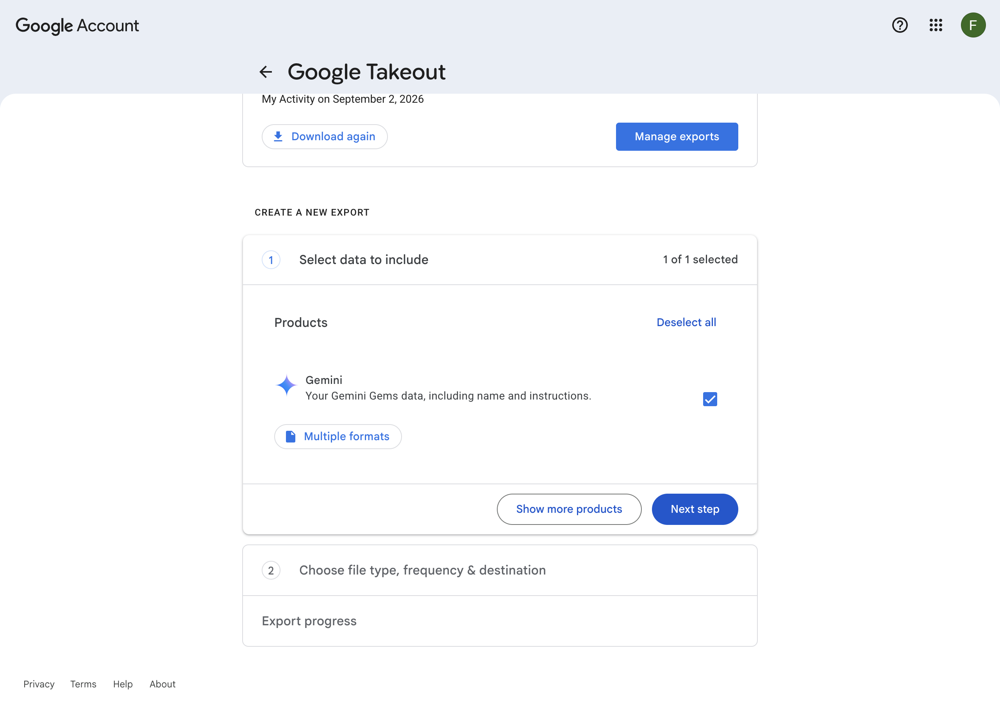
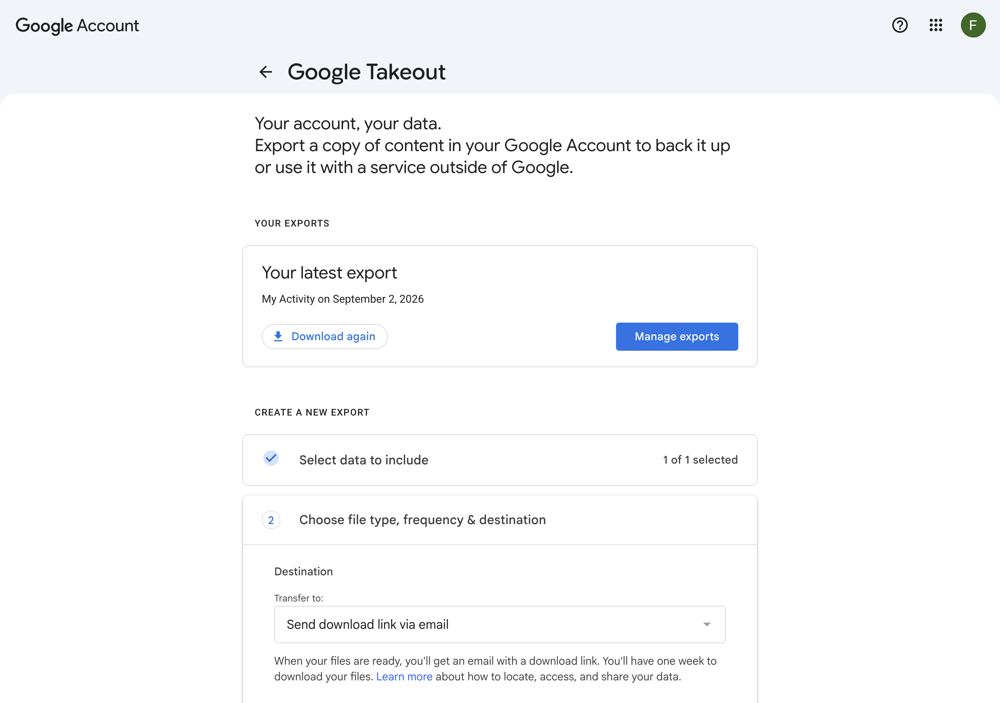
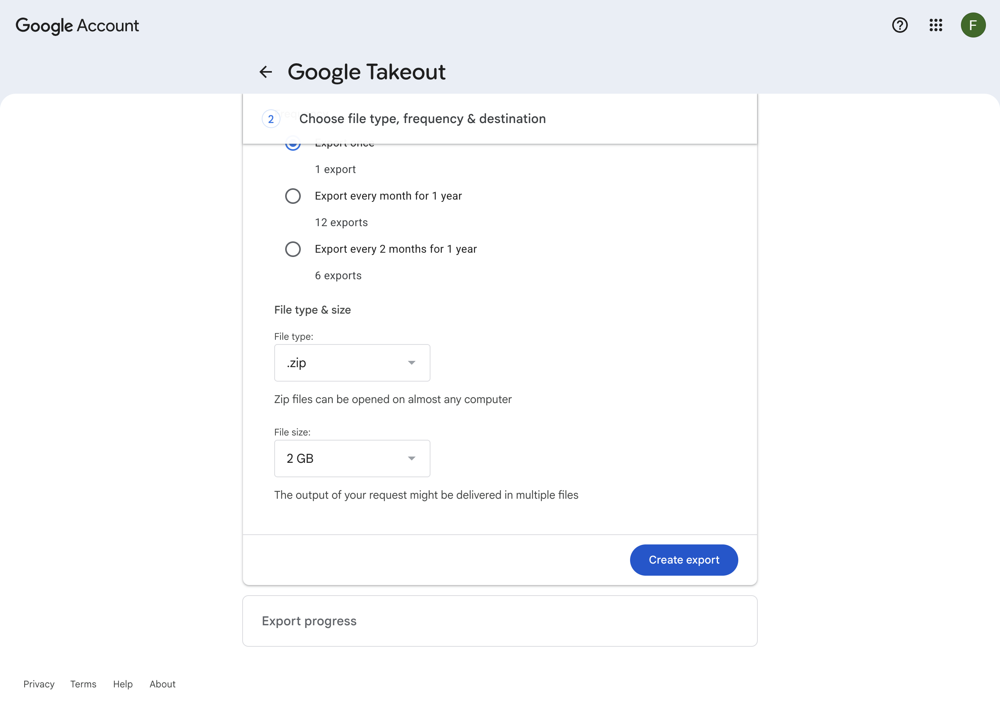
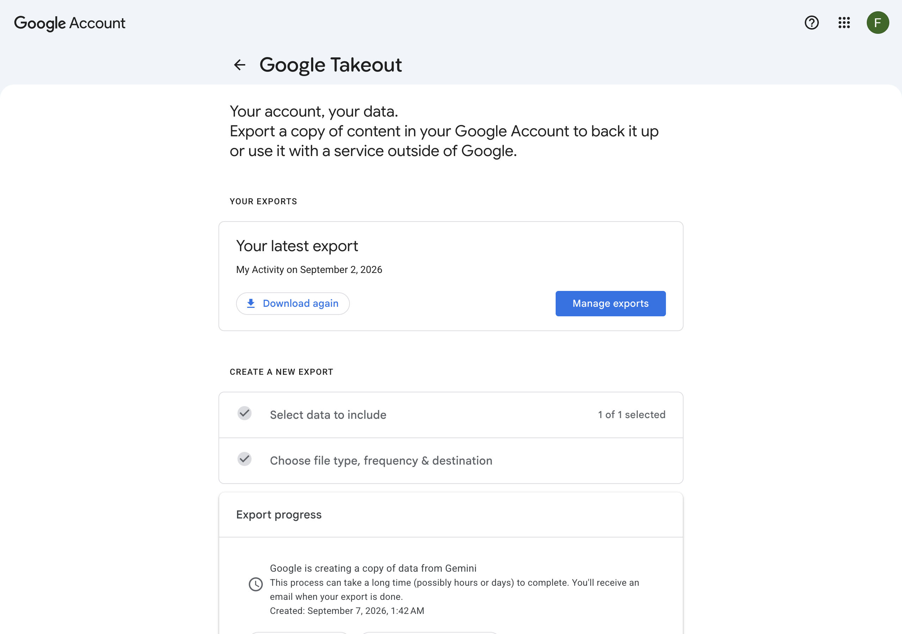
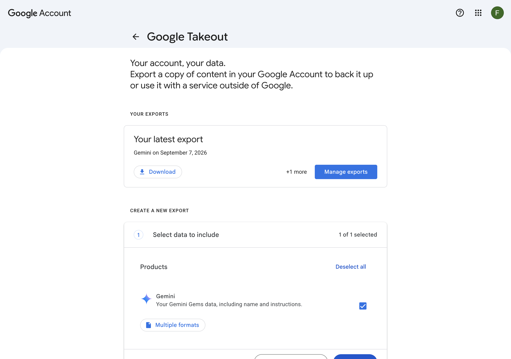

# Google Takeout 导出与历史归档导入完整指南 (Takeout Guide)

> 本指南配合 Gemini Exporter 插件使用。当您在 Gemini 中积累了成百上千条历史对话，触发 Google 服务端游标窗口限制（约 600 条）时，可通过 Google Takeout 官方全量归档无损导出全部远古历史与媒体附件。

---

## 🚀 步骤一：使用专属直达链接（自动勾选 Gemini）

访问官方预筛选直达链接：
👉 **[https://takeout.google.com/settings/takeout/custom/gemini](https://takeout.google.com/settings/takeout/custom/gemini)**

> [!TIP]
> **无需手动“取消全选”并寻找 Gemini**：该直达链接已预先配置过滤规则，进入后 Google 会**自动取消其他 60 多款产品的勾选**，并**仅保留 Gemini 一项**！

确认勾选状态后，点击页面右下角的 **「Next step」（下一步）**。

---

## ⚙️ 步骤二：选择文件类型、导出频率与分卷大小

进入导出设置页面：

建议参数配置如下：
1. **Transfer to（目标位置）**：保持默认 `Send download link via email`（通过电子邮件发送下载链接）。
2. **Frequency（导出频率）**：保持默认 `Export once`（导出 1 次）。
3. **File type（文件类型）**：保持默认 `.zip`。
4. **File size（文件大小）**：默认 `2 GB`。如果您的 Gemini 对话包含大量多模态高清图片/长会话，**推荐下拉选择 `50 GB`**，避免数据被切分为多个分卷。

确认无误后，点击蓝色的 **「Create export」（创建导出项）** 按钮。

---

## ⏳ 步骤三：等待 Google 生成导出归档

点击后，Google Takeout 会进入导出处理队列：

- Gemini 的数据主要是会话文本与图片元数据，导出速度极快（通常 **10 秒 ~ 2 分钟** 即可完成打包）。
- 打包完成后，您的 Gmail 邮箱会收到一份通知邮件；或者直接刷新当前页面即可看到下载按钮。

---

## 📥 步骤四：下载 Takeout ZIP 归档包

打包完成后，页面上方会显示 **「Your latest export」（您近期的导出项）**：

点击 **「Download」（下载）** 按钮，将 `takeout-*.zip` 压缩文件保存到您的本地磁盘。

---

## 🧩 步骤五：导入 Gemini Exporter

1. 打开 Gemini Exporter 批量工作台（Options 页面）。
2. 将下载好的 `takeout-*.zip` 文件**直接拖拽**到“Google Takeout 导入”区域，或点击 **「📥 选择 Takeout ZIP 导入全部历史」**。
3. 插件将全在本地沙盒中毫秒级解析全部历史 Prompt 与会话，自动完成去重合并，并建立离线媒体索引池！
