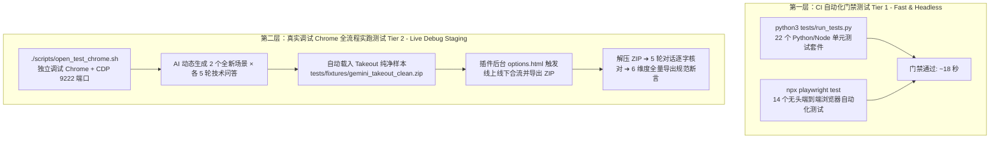

# Gemini Exporter 测试架构与规范指南 (Testing Architecture & Guide)

本项目构建了严密、分层的**双层测试体系 (Two-Tier Testing Architecture)**，兼顾了 CI 门禁的极致速度与生产环境真实链路的绝对可靠性。无论是人类开发者还是 AI 编程助手，在进行功能开发、Bug 修复或重构时，均须遵守本指南中的测试规范。

---

## 一、双层测试体系架构总览



---

## 二、第一层：CI 自动化门禁测试 (Tier 1: Fast & Headless)

### 1. 定位与设计原则
* **轻量极速**：完全在本地与 GitHub Actions 虚拟环境中运行，无须连接外网，无须真实 Google 账号。
* **高覆盖度**：覆盖核心解析引擎、数据存储层、多级标题仲裁、DOM 抓取契约、会话排序算法与无头端到端导出交互。
* **执行总耗时**：~18 秒。

### 2. 运行方式
在仓库根目录下执行：
```bash
# 执行全部单元测试与端到端测试
npm test

# 或分别执行
npm run test:unit    # 运行 python3 tests/run_tests.py (22 个单测套件)
npm run test:e2e     # 运行 npx playwright test (14 个 Playwright 用例)
```

### 3. 测试套件构成
* **单元测试（22 个套件）**：
  * `gemini_parser.test.js`：Protobuf/JSPB 递归解析器与遥测节点过滤；
  * `takeout_engine.test.js`：Google Takeout 解压、HTML 解析、图片 C2PA 关联；
  * `conversation_order.test.js`：会话列表按 `updatedAt` 正确排序；
  * `conversations_store.test.js`：状态管理与持久化；
  * `chat_formatter.test.js`：Markdown/JSON/HTML/CSV 序列化逻辑；
  * `dom_scraper.test.js`、`storage_service.test.js`、`sync_controller.test.js` 等。
* **端到端测试（14 个 Playwright 用例）**：
  * `export_zip.spec.js`：真实 ExportEngine 打包导出并在内存中解压校验 Markdown 产物；
  * `multi_tier_title_arbitration.spec.js`：多级非破坏性标题仲裁与保护；
  * `export_session_recovery.spec.js`：导出中断恢复与会话横幅保持；
  * `page_sync.spec.js`：活跃会话感知与去后缀同步；
  * `legacy_data_healing.spec.js`：脏历史数据自愈迁移等。

---

## 三、第二层：真实调试 Chrome 全流程实跑测试 (Tier 2: Live Debug Staging)

### 1. 定位与设计原则
* **真实网络与协议验证**：直连真实 Google Gemini 服务器，检验最真实的 batchexecute RPC 流式响应与前端页面变动；
* **线上线下合流验证**：通过 CDP 将真实 Google Takeout 历史样本导入插件，检验离线图片附件池索引与线上活跃会话的合流去重；
* **物理文件落盘检查**：坚决杜绝“仅凭内存或状态码就判定成功”，必须将 ZIP 下载到磁盘、实际解压、并对生成的 Markdown 进行严苛的内容与格式断言。

### 2. 前置准备（只需启动一次）
在终端中启动用于测试的独立 Chrome 实例（使用隔离的独立用户数据目录，开启 9222 远程调试端口）：
```bash
# macOS / Linux
./scripts/open_test_chrome.sh

# Windows (PowerShell)
.\scripts\open_test_chrome.ps1

# Windows (CMD)
.\scripts\open_test_chrome.cmd
```
> **注意**：启动后，若尚未登录，请在弹出的 Chrome 中登录固定测试 Google 账号。

### 3. 执行全流程测试
```bash
# AI 协同验收模式：现场构思全新主题并于 2 分钟内传入执行
python3 scripts/test_live_chat_and_export.py --dataset <path_to_fresh_dataset.json>

# 人工本地调试或离线复现模式：追加 --allow-stale-dataset 绕过 2 分钟时效门禁限制
npm run test:live -- --allow-stale-dataset

# 支持的常用参数：
python3 scripts/test_live_chat_and_export.py \
  --delay 2               # 轮次间等待秒数 (默认 2) \
  --port 9222             # Chrome 调试端口 (默认 9222) \
  --dataset <path>        # 传入现场生成的测试用例 JSON (2 分钟内有效) \
  --allow-stale-dataset   # 显式允许历史旧数据集或默认数据集（供人工调试使用） \
  --skip-chat             # 跳过在线发帖，直接使用已有会话与 Takeout 跑导出与断言 \
  --skip-takeout          # 跳过 Takeout 导入步骤 \
  --skip-reinstall        # 跳过 CDP 扩展卸载与重装步骤 \
  --skip-tour             # 跳过新手向导测试步骤
```

---

## 四、AI 编程助手执行测试的严格守则

任何协助开发本项目的 AI（无论是 Antigravity、Claude、Cursor、Copilot 或其他 AI 助手），在执行测试时必须严格遵守以下守则：

### 守则 1：严禁偷懒，完整跑完 2 会话 × 5 轮发帖
* 在对核心解析器（Protobuf/JSPB）、会话排序、网络请求机制进行改动后，必须运行完整的实跑测试。
* 除非在单独调试离线组件并向用户明确说明，**严禁滥用 `--skip-chat`**。必须每次动态生成 2 个富有技术深度的技术主题（如并发架构、分布式算法、底层编译器等），各执行 5 轮真实问答并拿到真实回复。

### 守则 2：必须实际检查导出文件的文本内容与图片
* 导出不是终点，断言文件内容才是验证的核心。
* 必须确保解压后的 Markdown 准确包含了刚才提问与回答的全部 5 轮文字。
* 必须确保图片附件在解压包中物理存在（字节数合法，非空占位）。

### 守则 3：必须满足导出规范断言器的 6 大维度
测试脚本已内置集成 `tests/helpers/export_spec_asserter.py`，导出的每一个 Markdown 文件必须 100% 满足：
1. **0 遥测噪点**：绝对禁止泄露 Google JSPB 遥测单字（如单独成行的 `google`, `c`, `S`, `6`, `.`）；
2. **0 语言标记泄露**：回答末尾绝不能残存 `zh`、`en` 等流式分段元数据；
3. **YAML Frontmatter 完整合规**：包含且仅包含规范键值（`title`, `id`, `url`, `date`, `updated`, `exported`, `tags`）；
4. **问答轮次规范**：`## 👤 你` 与 `## 🤖 Gemini` 交替配对，携带 `> ⏱️` 时间戳；
5. **多媒体资产有效性**：Markdown 中的图片链接与包内本地附件物理对齐；
6. **黄金会话特征命中**：代码块（```python, ```rust）与 ASCII 图表语法完好。

---

## 五、关键测试资源清单

* `tests/fixtures/gemini_takeout_clean.zip`：测试账号真实剥离后的纯净 Takeout 样本（包含 6 条已知历史会话与火星猫图片资产）；
* `tests/helpers/export_spec_asserter.py`：全维度 Markdown 导出规范断言与 Lint 核心模块；
* `scripts/test_live_chat_and_export.py`：第二层全流程实跑编排器（CDP 控制、实时问答、Takeout 导入、ZIP 导出与解压断言）；
* `scripts/open_test_chrome.sh` / `scripts/open_test_chrome.ps1` / `scripts/open_test_chrome.cmd`：自动化拉起独立调试 Chrome 的跨平台脚本。
